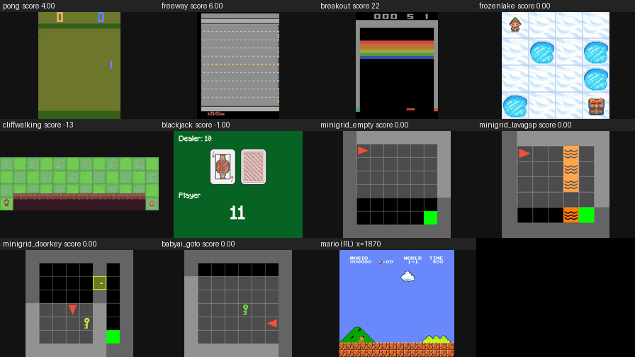

# decider: one-pass typed decisions with calibrated probabilities

[](https://github.com/Mapika/decider/actions/workflows/tests.yml)
[](https://huggingface.co/Mapika/decider-2b)
[](LICENSE)



A language model that does not generate text. It reads a **state** and a set of **typed questions** and returns, from a
single forward pass, a probability distribution for every question: no decoding, no parsing, no output outside the
options you defined. It is an open reproduction of the "System One" model class (TypeSafe AI's *Jev*), built on
`Qwen/Qwen3.5-2B-Base` and trained on one GH200.

| model | | |
|---|---|---|
| [decider-2b](https://huggingface.co/Mapika/decider-2b) | the main model: text and JSON states, up to 255 options, 32k tokens | in-task 0.81, held-out 0.74 on 93 public tasks |
| [decider-0.8b](https://huggingface.co/Mapika/decider-0.8b) | same recipe from Qwen3.5-0.8B-Base, 1.5 GB | 0.78 / 0.71, same calibration; loses on knowledge tasks, not on the decision format |
| [decider-2b-vision](https://huggingface.co/Mapika/decider-2b-vision) | decisions from an image plus the same prompt | [try it in the browser](https://huggingface.co/spaces/hugging-apps/decider-2b-vision-demo) (Space built by the Hugging Face team) |

```bash
pip install git+https://github.com/Mapika/decider          # or: git clone ... && pip install -e ".[serve]"
```

```python
from decider.infer import Decider
d = Decider("Mapika/decider-2b")                             # one CUDA GPU, bf16, about 4 GB; downloads the weights on first use
d.system_one(
    {"ticket": {"messages": [{"from": "customer", "text": "I was charged twice for order A-104. Please refund the duplicate."}]},
     "refund_policy": "Duplicate charges are eligible for a refund."},
    {"department": {"type": "choice", "instructions": "Which team should handle this?",
                    "criteria": {"returns": "Exchanges, refunds, wrong or damaged items", "billing": {"what": "Charges, invoices", "not_for": "delivery"}, "other": None}},
     "refund_requested": {"type": "noul", "instructions": "Does `ticket.messages[0].text` request a refund?"},
     "frustration": {"type": "score", "instructions": "How frustrated is the customer?", "criteria": ["calm", "frustrated", "very frustrated"]}})
# {"answers": {"department": {"choice": "billing", "confidence": 0.65, "certainty": ..., "probabilities": {"returns": 0.33, "billing": 0.65, "other": 0.02}},
#              "refund_requested": {"noul": 0.99},
#              "frustration": {"score": 0.72, "probabilities": {...}, "level_fit": {"0": 0.39, "1": 0.55, "2": 0.10}, "fit_mass": 1.04}}}
#                                                             (v8 weights; "returns" also mentions refunds, hence the split)

d.decide("My card was charged twice.", [{"question": "Which team?", "options": ["billing", "technical", "sales"]}])
# [{"choice": "billing", "confidence": 0.77, "probs": {"billing": 0.77, "technical": 0.19, "sales": 0.04}}]      the plain form
```

`examples/` has three complete programs (confidence-gated routing, composite scoring, a hierarchical beam over Choice
probabilities); `python examples/routing_with_confidence.py` runs against the released weights.

## What it does

| | |
|---|---|
| question types | **Choice** (2-255 options, each optionally with a description or a JSON rubric), **Score** (2-10 described levels, returns the expected level), **Noul** (probability of yes) |
| state | a string, or any JSON value; questions can name a part of it by path (`` `tickets[3].text` ``); up to 32k tokens |
| independence | every question is scored on its own: adding, removing or reordering questions cannot change another answer |
| isolated levels | every Score level is judged alone (it sees neither its number nor its neighbours); the per-level fits are normalised |
| abstention | a catch-all option ("other", "none of the above", ...) is chosen when nothing on offer fits |
| calibration | trained with a proper scoring rule; one temperature fitted on in-task data, checked on held-out tasks |
| wire format | `POST /v1/systemone` is TypeSafe's format; their SDKs work unchanged with `TYPESAFE_BASE_URL` pointing at `decider.serve` |
| speed | CUDA-graph engine, FP8, and a **schema cache**: a fixed question set is computed once, requests run only the state |

## How it works

`decider/prompt.py` renders a request as text with one answer slot per question; `decider/model.py` reads the hidden state at
each slot, projects it onto one label token per option (A-J, then K-Z and two-letter tokens up to 255) and softmaxes over the
valid ones. Letters are never generated, so all slots come out of one pass.

Two layouts are trained, 50/50. **State-first** (`Context ... Question ... Options ... Answer: (`) is the original.
**Schema-first** puts the question/option blocks before the state, so they are a prefix that does not depend on the state:
`decider/schema_engine.py` runs that prefix once per schema, keeps its cache (attention K/V of the 6 full-attention layers, conv
and recurrent state of the 18 delta-net layers) read-only, and a request runs only `Context: <state>` plus the slots, as a CUDA
graph per (batch, length) bucket. Independent scoring uses one cached prefix per question (or per Score level) and one row each.
For the state-first layout the same idea works the other way round (`Engine.score_shared`): the state is run once and its
cache forked to every question, which is the delta-net equivalent of a block attention mask.

## Layout

```
decider/prompt.py        the two prompt layouts, label table, answer slots
decider/model.py         DecisionModel: backbone -> slot hidden states -> option logits
decider/systemone.py     Choice / Score / Noul with criteria -> prompt rows; typed answers; isolated levels; index annotation
decider/infer.py         Decider: system_one(), schema() (compiled, cached question sets), decide()
decider/engine.py        shape-bucketed CUDA graphs, torch.compile, shared-prefix scoring;  fp8.py  e4m3 linears
decider/schema_engine.py schema cache (read-only prefix cache + suffix graphs)
decider/serve.py         HTTP server: /v1/systemone, /decide, continuous batching per schema and length bucket
decider/data/            task registry (~95 public datasets), augment.py (all input-shape augmentations), mixture.py (the mixture
                         and the probes), teacher_*.py (label descriptions, custom questions, situations from a local 27B teacher)
decider/train.py         cross-entropy fine-tune, token-bucketed batches, random layout per example, abstain augmentation
decider/evaluate.py      accuracy / NLL / Brier / ECE / AURC / selective accuracy per task;  report.py  comparisons, temperature fit
decider/probes/          hand-written batteries, question independence, isolated levels
decider/bench/           engine and schema-cache benchmarks, HTTP load test
decider/games/           ten text games + Super Mario Bros behind the same interface, imitation and PPO
decider/vision/          the vision-language variant (decisions from pixels)
teacher_data/            the teacher-written data the mixture needs (label descriptions, custom questions, routing messages, situations)
scripts/                 train.sh, evaluate.sh, serve.sh, stage_release.py, upload_hf.py
examples/                routing with confidence gates, composite scoring, hierarchical beam over Choice probabilities
tests/                   unit tests for the request/answer layer and the prompt layouts (no GPU; `python -m pytest tests`)
docs/HISTORY.md          how the released weights were actually produced (v1 to v9) and what was measured at each stage
```

## Train

```bash
uv venv --python 3.12 .venv312 && uv pip install -p .venv312/bin/python -e ".[serve,train]"
scripts/train.sh full                       # datasets -> data/tasks.pkl -> data/mixture_full.pkl -> one epoch from Qwen3.5-2B-Base -> scripts/evaluate.sh
scripts/train.sh delta runs/some/model      # or: continue an existing decider checkpoint on the new formats + a replay sample
```

`decider/data/mixture.py` lists every component of the mixture with its size. The released weights were produced in stages
(`delta` runs on top of each other, see `docs/HISTORY.md`); `full` is the same data as a single run, and it reproduces them:
one epoch (1.47M examples, 455M tokens, 5.3 h on a GH200 plus 45 min of evaluation) gives a model that matches v9 on the 94-task
set (in-task 0.809 vs 0.812, held-out 0.739 vs 0.741 on the shared tasks) and on every probe family below within noise, with a
fitted temperature of 1.03 instead of 1.36 (better calibrated before scaling: in-task ECE 0.030 vs 0.056). Held-out terse-bucket
routing came out higher (generic / specific / catch-all 0.91 / 0.94 / 0.92) and held-out Freeway play returned (9 against the
teacher's 5); the 16-page browser probe came out lower (0.75 / 0.69). The `Results` numbers are still the staged v8/v9 weights.

## Serve

```bash
scripts/serve.sh Mapika/decider-2b 8000
curl -s localhost:8000/v1/systemone -H 'content-type: application/json' -d '{"state": "My card was charged twice.",
  "questions": {"team": {"type": "choice", "instructions": "Which team?", "criteria": {"billing": "charges, refunds", "technical": "bugs, outages"}},
                "refund": {"type": "noul", "instructions": "Is a refund needed?"}}}'
TYPESAFE_BASE_URL=http://localhost:8000 TYPESAFE_API_KEY=local python your_typesafe_sdk_script.py
```

A schema seen twice gets a cached prefix and its own graphs; `DECIDER_SCHEMAS=schemas.json` preloads and compiles known schemas
before traffic. In process: `s = d.schema(questions, compile=True); s(state); s.batch(states)`.

## Results

All numbers are for the v8 weights (`runs/r13_v8`; v9 = v8 plus the terse-bucket and command data, same numbers on the 94 tasks), measured on one GH200. "Held-out" means no example of that dataset was trained on.
`docs/HISTORY.md` has the per-stage measurements (v1 to v9) and the v5/v6 baselines quoted here.

**94 public tasks, original protocol** (large label sets sub-sampled to 10 options; one temperature fitted on in-task data)

| | in-task acc / ECE (69 tasks) | held-out acc / NLL / ECE (24 tasks) |
|---|---|---|
| Qwen3.5-2B-Base, zero-shot | 0.620 / 0.121 | 0.642 / 0.853 / 0.105 |
| decider v8, state-first (default), T=1.30 | 0.811 / 0.037 | 0.741 / 0.655 / 0.088 |
| decider v9, state-first (default), T=1.36 | 0.812 / 0.041 | 0.741 / 0.655 / 0.087 |
| decider v8, schema-first (the cacheable layout), T=1.18 | 0.790 / 0.038 | 0.707 / 0.757 / 0.104 |
| **`scripts/train.sh full`**, one run from the base model, T=1.03 | 0.809 / 0.030 | 0.739 / 0.620 / 0.079 |

Schema-first is a speed-for-accuracy trade, and the cost depends on the workload: on the 69 tasks with a fixed label set
(classification, routing, scales: what a cached schema is for) it loses 1.5 points on average (median 0.7, calibration equal); on the 24
tasks whose options change per example (multiple-choice QA, tool choice) it loses 5, because the options are read before the
question they belong to; on full label sets of 50-219 options and on states of several thousand tokens it loses 5-24 (table below).
State-first is therefore the default and the schema cache is opt-in (`Decider.schema`, `DECIDER_SCHEMA_CACHE=1`).

**Input shapes** (accuracy; state-first unless noted)

| | v5 | v8 | v8 schema-first |
|---|---|---|---|
| all 64 / 50 / 70 / 219 labels offered at once: HWU64, TREC-fine, DBpedia L2, L3 (held-out) | 0.25 / 0.29 / 0.17 / 0.09 | 0.84 / 0.72 / 0.73 / 0.86 | 0.80 / 0.48 / 0.60 / 0.69 |
| CLINC 151-way / Banking 77-way | 0.11 / 0.19 | 0.88 / 0.87 | |
| options named by opaque ids, only descriptions tell them apart (8 held-out tasks; plain names: 0.77) | 0.73 | 0.78 | 0.75 |
| JSON state, question names one of 4 / 16 / 64 records by path (one record: 0.70) | 0.60 / 0.51 / 0.43 | 0.69 / 0.64 / 0.51 | 0.65 / 0.53 / 0.45 |
| same, 16 / 64 records, array positions written into the state (`render_state` does this) | | 0.68 / 0.62 | 0.61 / 0.60 |
| the record is in an 11k-token / 20-30k-token state | 0.45 / 0.47 | 0.61 (0.68 indexed) / 0.57 | 0.49 |
| QuALITY, whole article (5-8k tokens); clipped to 5000 characters: 0.50 | 0.71 | 0.70 | 0.56 |

**Custom questions and catch-all options** (v6 to v8; v7 added teacher-written data for exactly this)

| | v6 | v8 |
|---|---|---|
| hand-written battery: the GENERIC option is right although a catch-all is offered ("support" vs "other") / the catch-all is right | 0.60 / 0.90 | 0.85 / 0.95 |
| teacher-written routing messages, 6 held-out domains: generic / specific / catch-all | 0.50 / 0.95 / 0.82 | 0.94 / 0.97 / 0.90 |
| teacher-written custom questions, held-out domains: noul / choice / score | 0.94 / 0.96 / 0.74 | 0.96 / 0.98 / 0.83 |
| off-topic abstention probe / abstention battery | 0.83 / 7 of 8 | 0.83 / 8 of 8 |

The teacher labels come from Qwen3.5-27B; the hand-written battery (60 choice cases, 49 yes/no) is small. Both are in the repo.

**Terse buckets and applications (v9).** v8 needed the generic option to look like a bucket (`general_support`); v9 adds teacher-written
messages over plain option lists (`support`, `help`, `account`, no descriptions) and labelled shell commands. Held-out terse-bucket
messages, generic / specific / catch-all: v8 0.59 / 0.96 / 0.93, v9 0.86 / 0.95 / 0.88; hand battery 0.95 / 0.95 / 0.90. The 94-task set
is unchanged (0.812 / 0.741). Three hand-written application checks (`decider/probes/applications.py`), zero-shot:

| | v8 | v9 |
|---|---|---|
| model router, 31 prompts: tier (small / code / large reasoning / a person) and "needs live data" | 0.90 / 0.81 | 0.94 / 0.84 |
| shell command safety, 45 commands: safe / caution / destructive, and "touches things outside the project" | 0.71 / 0.56 | 0.80 / 0.98 |
| browser agent, 16 page states as JSON: which element to act on, which action | 1.00 / 0.88 | 1.00 / 0.88 |

No destructive command was ever called safe; the command misses are caution/safe borderlines (`npm run build`, `mkdir && cp`).

**Form filling, against a specialist (`decider/probes/cua_s1_forms.py`).** Cua's CUA-S1-FORMS (2026-09-18) is a 0.7M-parameter
byte-level System One model for one task: for each form element, pick the document value to fill in, or check / click / skip. On
its synthetic test split (14,254 decisions, forms disjoint from its training forms) it scores 0.9995; its card puts Jev's hosted
API at 0.836. decider v9, zero-shot, scores 0.41 with their bare strings (it almost never chooses a bare `skip`), 0.67 with a
one-sentence question and `skip (leave this element alone)`, and 0.24 when every rule is spelled out in the question. Entities are
rarely confused (wrong target on 229 of 6,018 fills); the misses are the action conventions, above all re-filling an already filled
field. See Limitations.

**Bespoke's public suite, against Nimble-9B and Jev (`decider/bench/public_suite.py`).** Bespoke Labs released
[Nimble](https://github.com/bespokelabsai/nimble) (2026-09-19, Qwen3.5-9B + LoRA on 2,676 contrastive examples) with a suite of 13
human-labelled subsets, 3,880 records in Jev's wire format, on which they measured both Nimble and Jev 1.13.0. The subsets rebuild
byte-for-byte from their manifests; decider v9 answers them through `system_one` as shipped (T=1.36, isolated levels). "trained" marks
tasks whose *train* split is in decider's mixture (their records come from test/validation splits).

| subset (type) | decider-2b v9 | Nimble-9B | Jev 1.13.0 |
|---|---|---|---|
| vitaminc-dev (choice, contrastive fact verification) | 0.651 | 0.766 | 0.801 |
| massive-en-US (choice, 18 scenarios; trained) | 0.826 | 0.869 | 0.874 |
| massive-de-DE (same utterances in German) | 0.794 | 0.834 | 0.869 |
| boolq (noul; trained) | 0.803 | 0.860 | 0.897 |
| squad2 (noul, answerability) | 0.786 | 0.806 | 0.829 |
| paws (noul, paraphrase; trained) | 0.716 | 0.828 | 0.892 |
| multinli (choice; trained) | 0.843 | 0.853 | 0.829 |
| civil_comments (noul; trained) | 0.843 | 0.703 | 0.810 |
| aegis2 (noul, prompt safety) | 0.720 | 0.812 | 0.804 |
| helpsteer2 (score, 5 levels; trained) | 0.438 | 0.390 | 0.341 |
| summeval-relevance (score) | 0.329 | 0.492 | 0.350 |
| summeval-consistency (score) | 0.646 | 0.757 | 0.812 |
| pubmedqa (choice; trained) | 0.720 | 0.756 | 0.772 |
| **macro / micro** | **0.701 / 0.711** | 0.748 / 0.759 | 0.760 / 0.773 |

Nimble's and Jev's numbers are copied from their report. A 2B model sits 5 points under a 9B and 6 under Jev on the average; it is ahead on
moderation (civil_comments) and on HelpSteer2, and behind most where a claim has to be checked against evidence that nearly matches it
(VitaminC, PAWS, SummEval consistency) and on prompt-safety judgments (Aegis). Listwise instead of isolated levels moves the Score
subsets both ways (relevance 0.43, consistency 0.49).

**Isolated Score levels.** Each level is judged in its own row, without its number or its neighbours; the per-level P(fits) are
normalised. Adding a level cannot change another level's fit. Against the usual listwise scoring (all levels in one list):

| | listwise acc / ECE | isolated acc / ECE | mean sum of fits |
|---|---|---|---|
| teacher-written score questions, held-out domains | 0.822 / 0.058 | 0.827 / 0.059 | 0.99 |
| HelpSteer2 (5 attributes, 5 levels) | 0.598 / 0.069 | 0.610 / 0.044 | 1.01 |
| hate-speech intensity scales | 0.563 / 0.058 | 0.552 / 0.032 | 1.04 |
| LIAR2 truthfulness (6 levels) | 0.370 / 0.048 | 0.337 / 0.075 | 1.12 |

Before training for it (v6) the same procedure lost up to 20 points and the fits summed to 1.4-3.5.

**Independence.** Packed into one prompt, reversing the question order changes up to 12% of answers (7 multi-question tasks).
Scored one row per question there is nothing to change, at the same accuracy (within 0.7 points of packed on every task).

**Speed** (GH200, bf16 + torch.compile + CUDA graphs; support tickets are ~230 tokens, chat messages ~12)

| in-process, per forward | full forward | schema cache | |
|---|---|---|---|
| 3 questions, tickets: 1 request / 32 requests | 4.0 / 74 ms | 3.4 / 47 ms | 1.2x / 1.6x |
| 10 described questions, tickets | 5.9 / 154 ms | 4.0 / 64 ms | 1.5x / 2.4x |
| 10 described questions, chat messages | 6.0 / 121 ms | 3.9 / 29 ms (11,180 decisions/s) | 1.5x / 4.2x |
| one question with 151 options, chat messages | 8.5 / 217 ms | 3.6 / 11.5 ms | 2.4x / 19x |
| 10 questions scored independently, chat messages | 14.3 / 276 ms | 4.6 / 75 ms | 3.1x / 3.7x |

Independent scoring with the cache reruns the state once per question, so it only pays for short states (tickets: 1.0-1.7x).
For long states the state-first path runs the state once and forks its cache per question (7 questions on 11k tokens: 252 ms
instead of 1464 ms). HTTP, 5 questions per request, tickets, without compile/FP8: `/decide` 193 req/s and `/v1/systemone` packed
with the schema cache 352 req/s at 64 clients (p50 8 ms at one client); independent scoring 70-75 req/s either way.

**Games.** The four trained text games stay at teacher level (Pong 8, Breakout 22, CliffWalking -13); held-out Freeway, 6 at v4, is 0.

## Limitations

* A 2B model without reasoning: knowledge-heavy multiple choice (MMLU, MedQA) improves little over the base model, and judgments
  that need several steps should be split into several questions.
* English only. Calibration is measured on public datasets and teacher-labelled probes, not on your traffic: check it on your own labels.
* The schema cache costs accuracy (see Results); use it for fixed classification-style schemas with short states.
* Generic buckets with plain names (`support`, `help`, `account`) next to a catch-all: v9 picks the bucket when it should (held-out
  terse-bucket messages 0.59 to 0.86; the `check_balance / approve_transfer / support / other` case that v8 got wrong now goes to
  `support` at 0.79-0.85) at a small cost on the catch-all side (0.93 to 0.88 on that probe; 0.62 to 0.58 on the abstention probe).
* Rules written into the question ("fill if empty, otherwise skip; check only if required and unchecked") are not followed at
  this size: on the form-filling probe a one-sentence question scores 0.67 and a paragraph of rules 0.24. State the decision as
  a plain question with described options; a task with a fixed convention wants examples of it in the mixture, not a rulebook.
* Picking one record out of a long JSON array by position is the weak input shape (0.51 with 64 records against 0.70 with one);
  address records by key, or let `render_state` write the index into the array (0.62).
* TREC-fine with all 50 labels fell from 0.76 (v6) to 0.72 (v8); held-out Freeway play fell to 0 and did not come back with the game data replayed.
* The custom-question data is labelled by a 27B teacher that shares some of the biases it is meant to fix (it agreed with only 72%
  of its own generic-option labels); see `decider/data/mixture.py` for how those labels are filtered.
* The vision variant (`decider/vision`) is still on v5 text weights, currently retraining.
* The released weights were produced by staged continuation runs (`docs/HISTORY.md`); `scripts/train.sh full` reproduces them in
  one run (see Train) but is not byte-identical to them, and the hand-written probes with 16-60 cases move by a few cases either way.

## Citation

```bibtex
@software{marosi2026decider,
  author = {Marosi, Mark},
  title  = {decider: one-pass typed decisions with calibrated probabilities},
  year   = {2026},
  url    = {https://github.com/Mapika/decider}
}
```
