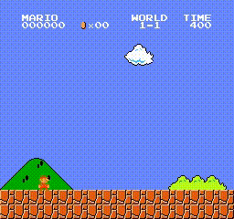

# decider — one-pass typed decisions with calibrated probabilities


*The v4 model playing every game in `decider/games.py` from text state descriptions (one typed decision per step, ~4 ms each), plus Super Mario Bros with the RL checkpoint. Built by `decider/montage.py`.*

Goal: reproduce the shape of TypeSafe AI's *Jev* (typed decisions with calibrated
probabilities, all fields from one forward pass, no token generation) on a
single GH200, starting from a modern small open base model.

## Design
* **Backbone**: `Qwen/Qwen3.5-2B-Base` (Feb 2026, hybrid linear-attention).
* **Interface**: `Context` + N typed `Question`s, each with an explicit option list.
  Every question gets an answer slot `Answer k: (`; the logits at that slot are
  restricted to the option-letter tokens `A..J` and softmaxed. All N decisions
  come from one forward pass (no decoding).
* **Candidate conditioning**: label sets larger than 10 are sub-sampled per
  example (gold always kept) and shuffled, so the model must read the options.
* **Training objective**: cross-entropy (a proper scoring rule) on ~60 public
  decision datasets (intents, routing, moderation, NLI, MCQ, sentiment, ...).
  Optional Brier term. Post-hoc temperature is fitted on in-task data and
  tested on held-out tasks.
* **Evaluation**: 47 in-task + 16 held-out (never trained) tasks. Metrics:
  accuracy, NLL, Brier, ECE, AURC, selective accuracy at 80% coverage.
  The held-out set is the important one: does calibration transfer to tasks
  the model never saw?

## Serving

```bash
DECIDER_MODEL=runs/r3_v2/model .venv312/bin/uvicorn decider.serve:app --host 0.0.0.0 --port 8000
curl -s localhost:8000/decide -H 'content-type: application/json' -d '{"context": "My card was charged twice.",
  "schema": {"Which department?": {"type": "choice", "options": ["billing", "technical", "sales"]},
             "Refund needed?": {"type": "bool"},
             "Urgency?": {"type": "scale", "legend": {"0": "low", "1": "medium", "2": "high"}}}}'
```
Requests arriving within a few milliseconds are scored in one forward pass. `decider.infer.Decider`
uses the same CUDA-graph engine in-process.

Measured on one GH200 (support-ticket contexts, ~230 tokens, 5 typed fields per request):

| | latency p50 | throughput |
|---|---|---|
| in-process `Decider.decide`, eager PyTorch | 49 ms | |
| in-process `Decider.decide`, CUDA-graph engine | 6.6 ms | |
| HTTP, 1 client | 10 ms | 97 req/s |
| HTTP, 4 clients | 25 ms | 150 req/s |
| HTTP, 64 clients | 231 ms | 263 req/s = 1314 decisions/s |

The single-request cost was launch overhead (1742 kernels per forward, GPU busy 5 ms of 44);
CUDA graphs remove it. Batched time was half elementwise kernels, a third matmul and 11% a
cuDNN depthwise-conv fallback; `torch.compile` (with `use_cache=False`, which avoids the
graph breaks) plus a fusable conv fixes the first and last, FP8 (`decider/fp8.py`,
e4m3 weights with per-token activation scales on the Hopper tensor cores) the matmuls.

Engine configurations, same GH200, in-process (`decider/engine.py`):

| engine | single request (228 tok, 3 q) | batch 32 | decisions/s at batch 32 |
|---|---|---|---|
| eager | 49 ms | 117 ms | 837 |
| CUDA graphs | 7.3 ms | 117 ms | 817 |
| + compile + fused conv (default) | 4.0 ms | 70 ms | 1367 |
| + FP8 linears (server default) | 4.1 ms | 58 ms | 1666 |

Accuracy is unchanged across all four (18-task check, 400 examples each: in-task accuracy
0.833 to 0.836, held-out ECE 0.070 to 0.072; see `runs/engcmp`).

HTTP server with the FP8 engine (default), same request mix, closed-loop clients:

| clients | req/s | decisions/s | p50 | p99 |
|---|---|---|---|---|
| 1 | 134 | 669 | 6.8 ms | 7.9 ms |
| 4 | 259 | 1293 | 15.5 ms | 17.5 ms |
| 16 | 334 | 1672 | 47.5 ms | 70.9 ms |
| 64 | 431 | 2152 | 126 ms | 267 ms |

Startup captures 72 (batch, length) shapes, about 8 minutes with compile + FP8; set
`DECIDER_COMPILE=0` for a 30 s start at eager speed.

## v4: situation-to-action data and multiple games

The v3 model had no "read a situation, pick the safe action" data, which is why it ran into the first
goomba zero-shot. v4 continues training from v3 on 45k such examples plus a 2x replay of the general
mixture (`decider/data3.py`, `decider/build_v4.py`; one epoch, 35 min):

* **AgentTraj-L** (AgentGym): ALFWorld, BabyAI, WebShop, ScienceWorld trajectories -> next action among candidates (20k)
* **Mind2Web**: which page element the next operation targets, among candidates (5.9k)
* **synthetic situations** from a local Qwen3.5-27B teacher (`decider/synth_gen.py`): 32 domains, 3-6 options, best action, danger flag (1.5k)
* **teacher-labelled game states** from the four training games below (12k) and Mario (6k)

On the 92-task set (T=1.15 fitted on in-task data, applied by default via `decider_config.json`):
in-task acc 0.813 / ECE 0.033 (69 tasks), held-out acc 0.748 / ECE 0.076 (23 tasks),
i.e. the same as v3 on the shared tasks, plus AgentTraj next-action 92%, Mind2Web 81%, synthetic 76%.

### Ten games behind one interface

`decider/games.py` renders each game's state as text and provides a scripted teacher; `decider/games_eval.py`
plays every game with the model, the teacher, and random. Four games contribute training data
(Pong, Breakout, CliffWalking, MiniGrid Empty); six are never trained on. Three episodes each:

| game | split | random | teacher | zero-shot-r3 | v4-r7 |
|---|---|---|---|---|---|
| pong | train | -20.00 | 8.00 | -21.00 | 8.00 |
| freeway | held-out | 0.00 | 5.00 | 2.00 | 6.00 |
| breakout | train | 1.33 | 22.00 | 7.00 | 22.00 |
| frozenlake | held-out | 0.00 | 1.00 | 0.00 | 0.00 |
| cliffwalking | train | -720.00 | -13.00 | -60.00 | -13.00 |
| blackjack | held-out | -1.00 | -1.00 | -1.00 | -1.00 |
| minigrid_empty | train | 0.00 | 0.96 | 0.00 | 0.00 |
| minigrid_lavagap | held-out | 0.00 | 0.00 | 0.00 | 0.00 |
| minigrid_doorkey | held-out | 0.00 | 0.00 | 0.00 | 0.00 |
| babyai_goto | held-out | 0.20 | 0.25 | 0.00 | 0.00 |

Atari and toy-text games reach teacher level from text alone; Freeway, never trained on, transfers
(and beats its teacher). The grid worlds fail for everyone including the teachers: the egocentric
7x7 view rendered as text is a poor state description and needs a map-based rendering before it
measures the model. Blackjack with three seeded hands is uninformative.

## Demo: Super Mario Bros from typed decisions

`decider/mario.py` drives the NES emulator (`gym-super-mario-bros`) with the model: every 4 frames the
emulator RAM is rendered as a short text state (ground, gaps, pipes, enemies ahead), the model answers
one choice field ("What should Mario do right now?": run right / jump right / long jump / jump up /
step left / wait) plus a bool ("Is Mario in immediate danger?"), and the action is held for the next
frames. Decisions take ~4 ms, far below the 67 ms of 4 frames.

```bash
uv pip install -p .venv312/bin/python gym-super-mario-bros==7.4.0 nes-py "gym==0.23.1" imageio imageio-ffmpeg
.venv312/bin/python -m decider.mario runs/r3_v2/model --episodes 3 --video mario.mp4
.venv312/bin/python -m decider.mario --policy heuristic     # scripted baseline on the same state text
```

Results on World 1-1 (3200 px long, deterministic emulator, 3 episodes each):

| policy | distance |
|---|---|
| button spam (right + jump) | 698 px |
| decider-2b zero-shot | 315 px (runs into the first goomba; danger field 0.07) |
| scripted teacher on the same state text | 2023 px |
| decider-2b fine-tuned on 6k teacher-labelled states (2 epochs, 5 min) | 2023 px |

Zero-shot, the classifier has no game sense: with a goomba one tile ahead it still says
"run right" at 0.85. After the short fine-tune (`decider/mario_data.py` labels states with
the scripted policy plus random-action noise for coverage, mixed with a replay of the general
data so the model keeps its other abilities) it reproduces the teacher exactly, reading only the
text, at 4.4 ms per decision. On seven levels never used for training (1-4, 2-2, 2-3, 3-2, 4-2, 7-1,
8-1) it matches the teacher's distance within a few pixels on six and beats it on 2-2, so it learned
the state-to-action mapping rather than a trajectory; its ceiling is the teacher's rules
(`--level`, `--noop_start` to desync the deterministic emulator). Videos: `media/mario_zeroshot.gif`, `media/mario_finetuned.gif`
(`media/mario_finetuned.mp4`).

 

### RL on top of imitation

The softmax over action options is a policy, so `decider/mario_rl.py` trains it with PPO-clip
directly against the emulator: 48 emulators in parallel, one batched forward per decision, reward =
tiles gained per decision, a death penalty and a flag bonus, per-level per-step baselines, 4
minibatch steps per iteration with a KL early stop. Warm-started from the imitation checkpoint,
40 iterations (~100 s each) on 8 training levels; greedy evaluation on those 8 and on 7 unseen levels:

| | train levels (mean px) | unseen levels (mean px) |
|---|---|---|
| imitation start | 766 | 774 |
| RL, best checkpoint (iter 20) | 1017 | 1080 |
| RL, final (iter 40) | 1072 | 780 |

Individual levels moved a lot (6-1: 502 to 2812 at one checkpoint; 1-1 past the teacher's 2023 to
2226; 3-2: 1125 to 2013), and sampled rollouts finished level 1-1, which the teacher never did.
Plain REINFORCE at a higher learning rate collapsed the policy within 10 iterations and at a lower one
did not move it; the clipped update with per-level baselines was what made it learn.
GIFs: `media/mario_rl_1-1.gif`, `media/mario_rl_6-1.gif`.

## Layout
```
decider/data.py        task registry -> Example(context, [Q(text, options, gold)])
decider/prompt.py      prompt/slot construction, multi-question packing
decider/model.py       DecisionModel: hidden state at slots -> letter logits
decider/train.py       finetune (bucketed shapes, bf16, grad-ckpt)
decider/evaluate.py    per-task metrics, saves probs
decider/report.py      side-by-side comparison + temperature scaling
decider/engine.py      Engine: shape-bucketed CUDA graphs (7x lower single-request latency than eager)
decider/serve.py       micro-batching HTTP server (POST /decide {context, schema})
decider/loadtest.py    closed-loop load test against the server
decider/bench_engine.py  eager vs CUDA graph vs torch.compile on fixed shapes
decider/bench_latency.py  decisions/s and latency of the one-pass interface (eager)
data/tasks.pkl    cached examples (python -m decider.data)
runs/             zs_2b, zs_4b (zero-shot baselines), r1_200k, ...
```
Model weights: https://huggingface.co/Mapika/decider-2b (after upload).
Setup: `uv venv --python 3.12 .venv312 && uv pip install -p .venv312/bin/python torch transformers peft accelerate datasets pillow "numpy<2" scikit-learn flash-linear-attention fastapi "uvicorn[standard]" httpx`.
