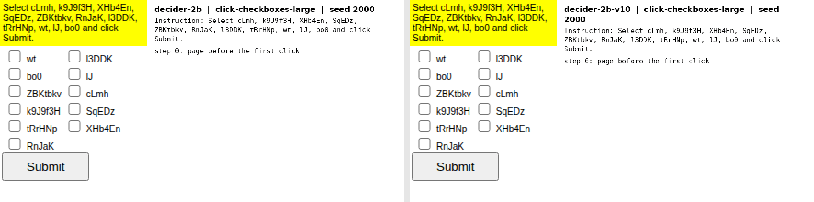
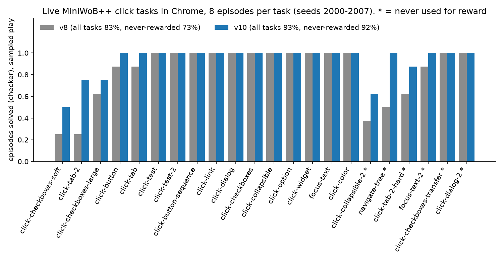
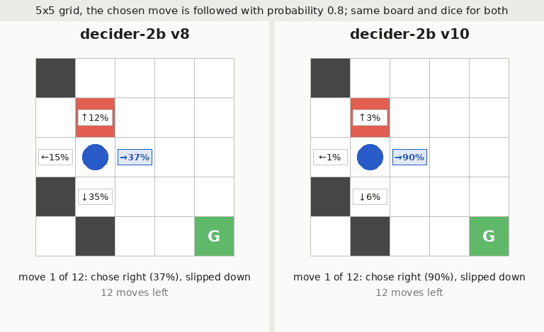
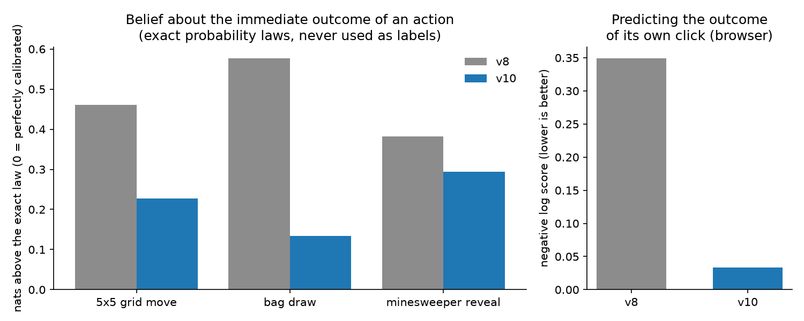
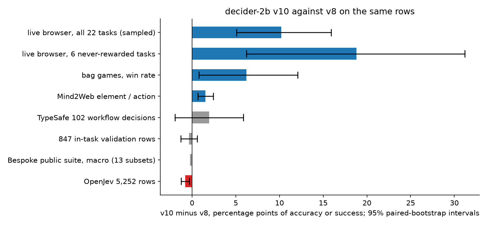

# Changelog

Newest first. Every entry names the weights it applies to; the Hub repositories keep earlier weights under tags where noted.
`HISTORY.md` is the long form: how each stage was trained and what was measured.

## 1.0.2 (2026-09-22): wrong answers from the cached shared-state path on Blackwell

Code only; no weights change. `decider.serve` scores the questions of one request against a cached prefix of the shared state
(`Engine.score_shared`), and the optional schema cache does the same for a cached schema. On a B300 with torch 2.14 / CUDA 13 the
cuDNN scaled-dot-product-attention backend that PyTorch selects for that masked rectangular attention (a suffix of a few hundred
tokens attending to a cached prefix of about 4,000) returns wrong, finite output in the first full-attention block; the math and
memory-efficient backends are correct, and the plain single-pass forward is unaffected. Effect: some long shared-state requests
got a wrong option with high confidence and the answer changed between identical requests. Reproduced on Decision Index row
RouterBench-5shot:26878 (prefix 4,006 tokens, suffixes 223 and 240): the cached path answered option_7 and option_10, the full
forward and the corrected path answer option_4 at p=0.95 and 0.93. Fix: `Engine` now disables the cuDNN SDPA backend before
compile and graph capture (`decider.engine.set_attention_backend_policy`). Found by an independent review of the serving path;
a review write-up with the reproduction commands is in the research notes. If you run the server from an earlier version on
Hopper or Blackwell, upgrade or set `torch.backends.cuda.enable_cudnn_sdp(False)` before constructing `Decider` or `Engine`.

## decider-35b-a3b v1 (2026-09-20): the supervised recipe on a 35B mixture-of-experts base

[Mapika/decider-35b-a3b](https://huggingface.co/Mapika/decider-35b-a3b) (bf16, 65 GB) and
[Mapika/decider-35b-a3b-nvfp4](https://huggingface.co/Mapika/decider-35b-a3b-nvfp4) (NVFP4 for vLLM and TensorRT-LLM, 19.6 GB).
One epoch of the public mixture on Qwen3.5-35B-A3B-Base with the routed experts frozen and Muon on the block matrices, 394
minutes on four B300s, no RL stage. Above decider-2b v10 on 93 of 95 regression tasks (in-task / held-out accuracy 0.855 / 0.810
against 0.805 / 0.755), +6.7 points on the validation rows, +5.0 on OpenJev, +6.9 on Mind2Web, JevBench hard tier 0.676 against
0.459, Bespoke's suite 0.774 against 0.704 macro. Greedy browser play 97.2% against 90.9%, sampled play 86.4% against 93.2%: the
argmax is right more often, the served distribution is less sharp, which is what the RL stage of v10 trains. The NVFP4 build
loses 1.0 to 1.5 accuracy points against bf16 in vLLM. Tables in the README ("Results"), training details and the AdamW
comparison in `HISTORY.md`, scripts in `moe/`.

## decider-2b v10 (2026-09-19): calibration-aware RL on live browser tasks and exact games

v10 is the v8 weights continued for 384 steps of reinforcement learning whose only rewards are outcomes: whether a browser task's
own checker reports success, whether a game is won, and how well the model's stated belief about the next outcome of an action
matches the exact probability law of the game. No gold labels enter. A hard KL limit to the v8 weights on replayed training rows
keeps the model's answers on its original tasks in place. The recipe, gates and every measurement are in [docs/RL.md](RL.md).

### Browser

*v8 (left) and v10 (right) on eight live browser tasks, same pages and seeds. Each click is one typed decision: the clickable
elements on the page are the options, the model returns a probability for each, and the task's own checker grades the result.
Six of the eight tasks were never used for training. Per-task recordings: `media/v10_browser_*.gif`.*

The browser gain is in the served distribution: greedy play is 90.9% against 90.3%, sampled play is where the ten points are, and
the six tasks that were never rewarded gain the most.

### Games

*Same boards, same dice for both versions. The numbers on the cells are the probabilities the model serves for each move; in
minesweeper the shading is the exact mine risk of each hidden cell, computed from all placements consistent with the revealed
numbers. Per-game recordings: `media/v10_game_*.gif`.*

A 2B model without search loses most of these games before and after RL. What moves is where the probability mass sits: in the
bag draws v10 puts 67% on the best bag where v8 spread 7% across many, and it wins 6 points more of them. On the grid, v10 puts 90%
on the right move where v8 put 37%, which helps when the move is right and hurts when the dice slip. Win rates on the same 234
boards, sampled play, with 95% intervals over boards:

| game | v8 | v10 | difference |
|---|---|---|---|
| bag draws (64 boards x 4) | 35.2% | 41.4% | +6.2 (+0.8 to +11.7) |
| 5x5 slippery grid (64 x 4) | 14.1% | 18.8% | +4.7 (−2.0 to +11.3) |
| tic-tac-toe against minimax with 25% random moves (74 x 4) | 23.6% | 23.0% | −0.7 (−4.7 to +3.0) |
| 4x4 minesweeper, 4 mines (32 x 4) | 2.3% | 0.0% | −2.3 (−4.7 to 0.0) |

### Calibration

Calibration is what the RL objective trains directly. For every action in a game with a known probability law, the model is
asked what will happen next, and its answer is scored against the exact law with a log score. v10 is 0.22 nats above the law
where v8 was 0.47. In the browser it predicts the outcome of its own click (success, failure, continue) at a log score of −0.03
against −0.35.

### Everything on the same rows

| on the same rows, v10 against v8 | v8 | v10 | difference (95% interval) |
|---|---|---|---|
| live MiniWoB++ click tasks, 22 tasks x 8 seeds, sampled play | 83.0% | 93.2% | +10.2 (+5.1 to +15.9) |
| the 6 tasks never used for reward | 72.9% | 91.7% | +18.8 (+6.2 to +31.2) |
| bag-draw games, win rate | 35.2% | 41.4% | +6.2 (+0.8 to +11.7) |
| Mind2Web element and action choice, 1,770 rows | 81.1% | 82.7% | +1.5 (+0.7 to +2.4) |
| TypeSafe workflow decisions, 102 rows, accuracy / NLL | 78.4% / 0.594 | 80.4% / 0.585 | +2.0 (−2.0 to +5.9) |
| 847 in-task validation rows, accuracy / NLL | 83.6% / 0.443 | 83.2% / 0.444 | −0.4 (−1.3 to +0.6) |
| Bespoke's public suite, 13 subsets, macro | 0.706 | 0.704 | |
| JevBench public items, easy / standard / hard accuracy | 1.000 / 0.861 / 0.459 | 1.000 / 0.847 / 0.459 | |
| the regression set rebuilt here, 67 in-task / 28 held-out tasks, accuracy | 0.806 / 0.757 | 0.805 / 0.755 | within noise |
| OpenJev, 5,252 rows | 64.1% | 63.3% | −0.8 (−1.3 to −0.3) |

What v10 does not change: general accuracy on its training tasks, calibration on Bespoke's suite, tic-tac-toe and minesweeper
play, and speed (same architecture, same readout, same temperature). The one measured regression is OpenJev, under one point.
v10 continues the v8 weights that were on the Hub; the v9 terse-bucket data described in the README is not in it.

## decider-2b v9: terse buckets and command safety

Teacher-written routing messages over plain option lists (`support`, `help`, `account`, no descriptions) and labelled shell
commands. Held-out terse-bucket routing, generic / specific / catch-all: 0.86 / 0.95 / 0.88 (v8: 0.59 / 0.96 / 0.93); the 94-task
set unchanged. v9 was described in the README but the Hub weights stayed v8, so v10 continues v8 and does not contain this data.

## decider-2b v8: isolated Score levels, generic options, second prompt layout

Every Score level judged in its own row with normalised fits; teacher-written custom questions with a generic option next to a
catch-all; the schema-first (cacheable) layout trained 50/50 with state-first. The weights are kept under the Hub tag `v8`.

## decider-2b v6 to v7: the input shapes Jev accepts

Described options, up to 255 options with one label token each, JSON states with path references, long inputs, and the
`POST /v1/systemone` request shape. Details in `HISTORY.md`, section "v6".

## decider-2b v5: the proper abstention fix

An abstain option is added to 10% of questions with three or more options; in a quarter of those the option list is replaced by
labels from an unrelated task so that the abstain option is correct.

## decider-2b v4: situation-to-action data and ten games

Next-action choice from agent trajectories and game states behind one typed interface (`decider/games/`), plus the Super Mario
Bros demo; the montage at the top of the README is this version.

## decider-2b v1 to v3: the one-pass readout

Cross-entropy on the letter logits at the answer slot over the public decision mixture, one temperature fitted on in-task
data. `HISTORY.md` has the per-stage numbers.
